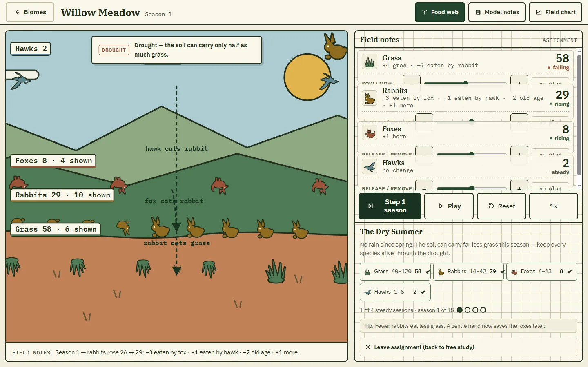

# EcoBalance

> Shiplo Showcase #13 — a natural-history field study where learners raise and
> lower populations and watch transparent ecosystem rules play out.

**Live demo:** <https://ecobalance.shiplo.site>
**Category:** education-science · **Audience:** 10–14 · **License:** Apache-2.0 (original work)



## Concept

EcoBalance is a small ecosystem diorama styled as a naturalist's field station.
The left half of the screen is a living scene — flat linocut silhouettes of
grass, rabbits, foxes and hawks (or reeds, hoppers, frogs and herons in the
wetland) standing on layered landscape bands. The right half is a graph-paper
field notebook where every population is a written count. Learners plan
interventions (release or remove animals, sow or mow plants), step the seasons
forward one at a time, and read exactly why every number moved: each season,
every species row lists its causes of change — "+11 grew · −9 eaten by
rabbit", "−1 you removed · +3 born". Field assignments add scripted events
(drought, habitat loss, a missing predator) with target ranges that must hold
steady for consecutive seasons, and a debrief chart turns any run into a
per-species field report.

The design language — deep forest green, clay, slate sky and cream paper;
IBM Plex Serif/Sans/Mono; solid-ink silhouettes with specimen count tags — is
original SVG drawn in code. No raster images, no runtime CDN, no emoji icons.

## Highlights

- **Transparent rules as the core object.** A pure simulation engine returns a
  typed cause for every population change, and the UI renders those causes as
  field annotations in the ledger, the season caption and the debrief.
- **Two biomes, four field assignments, all JSON.** Species parameters,
  trophic relationships, model notes, events and target ranges live in
  `public/data/*.json`; adding content never touches the code.
- **A deterministic, tested engine.** Same seed → same weather → same
  outcome. 1,611 headless checks (`npm run test:engine`) cover content
  validation, determinism, bounded free-play oscillation, a 300-run fuzz, a
  predator-starvation cascade, and keeper-policy solutions for every
  assignment.
- **Keyboard, touch and mouse drive the same controls.** Native sliders and
  buttons throughout, visible focus, polite live-region announcements of each
  season and every assignment outcome, ≥44 px targets on every screen.
- **Honest visuals.** Diorama token counts are capped and disclosed on-stage
  ("Rabbits 26 · 9 shown"), trends are icon + word + color (never color
  alone), and the model carries its caveat in the UI: "A simple teaching
  model — not a scientific forecast."

## Screenshots

| View | File | Viewport |
|---|---|---|
| Cover — meadow mid-study, food-web overlay on, drought banner, active assignment | `showcase/cover.webp` | 1440×900 |
| Desktop — the biome-select field-guide cover | `showcase/desktop.webp` | 1440×900 |
| Tablet (hero) — the field desk at season 2: diorama + ledger + assignments on one screen | `showcase/tablet.webp` | 1024×768 |
| Mobile — stacked field desk, ledger below the diorama | `showcase/mobile.webp` | 390×844 |

All captures come from the live deployment (`showcase/metadata.json` records
the exact URL and timestamp of each).

## Interactions

- **Biome select** — open the Willow Meadow or Heron Wetland field study;
  completed assignments and a device-local reset live in the footer.
- **Plan sliders** — each species row has a −10…+10 plan (Release/Remove for
  animals, Sow/Mow for plants) applied on the next season; the plan chip and
  `aria-valuetext` confirm it before and after.
- **Step / Play / speed / Reset** — advance one season, autoplay at 1×/2×/4×,
  or return to the biome's initial populations.
- **Food web** — toggle dashed predator→prey arrows over the diorama; focus a
  ledger row to bring that species' links forward.
- **Field assignments** — scripted event sequences with target ranges and a
  steady-seasons streak; success is announced, failure is an invitation to
  read the chart and try again.
- **Field chart** — a debrief overlay (Esc to close) with one line per
  species and a written summary of every run.

## Stack

Vanilla **TypeScript + Vite** — this is the framework-diversity "pure TS"
entry of the Shiplo showcase set (no React/Vue/Angular; DOM built with a tiny
`h()` helper). **GSAP 3.15** (bundled, no CDN) drives purposeful motion only:
token enter/exit when populations change, food-web line draws, banner
slide-ins and chart line reveals — all reduced to ≤150 ms fades or instant
states under `prefers-reduced-motion`. Fonts are self-hosted
**IBM Plex Serif/Sans/Mono** via `@fontsource` (latin, latin-ext and
vietnamese subsets).

## Static-first architecture

No database, no backend, no auth, no SSR. Content is two local JSON files;
state is a pure engine (`src/engine/`) separate from the DOM; the only
optional personal state is anonymous progress in `localStorage` (completed
assignments, last biome) with a two-tap reset. The production build runs from
any static host with relative paths (`base: './'`).

```text
ecobalance/
├── index.html
├── public/data/            # biomes.json, challenges.json — the content layer
├── src/
│   ├── engine/             # pure simulation: types, seeded rng, sim, challenge
│   ├── components/         # art.ts (linocut SVG system), notes.ts
│   ├── screens/            # biomes.ts, sim.ts, debrief.ts
│   ├── lib/                # data (load+validate), dom, gsap wrapper, storage
│   ├── styles/             # tokens.css, base.css, motion.css
│   └── main.ts
├── scripts/                # engine-sim.mjs (1611 checks), cdp-driver.mjs, capture-shots.mjs
├── design/DESIGN_DECISIONS.md
└── showcase/               # deployment.json, metadata.json, *.webp
```

## Development

```bash
npm install
npm run dev          # local dev server
npm run test:engine  # headless engine validation (1611 checks)
npm run build        # tsc -b && vite build → dist/
npm run preview      # serve dist/ locally
```

Deploy `dist/` to any static host — the live demo runs on Shiplo. The project
CDP driver verifies the full interaction flow against any URL:

```bash
node scripts/cdp-driver.mjs <url> --out .shots --w 1024 --h 768
```

## Open source

This project is part of the Shiplo Showcase and is distributed under the
Apache License 2.0. See `LICENSE` and `NOTICE`.

Shiplo names, logos and brand assets are handled separately from the
source-code license. See the repository `TRADEMARKS.md`.

Third-party material redistributed with this project is documented in
`THIRD_PARTY_NOTICES.md` (policy: repository `THIRD_PARTY_POLICY.md`).

This showcase is art-directed and maintained by Shiplo HQ with AI-assisted
implementation.

## Security and production use

This project is a demonstration/reference implementation, not a security
audit or a production-readiness guarantee.

If you adapt it for production use, you are responsible for reviewing and
hardening the code for your own threat model, dependencies, privacy
requirements, compliance obligations, hosting configuration and user data.

See `SECURITY.md` in the repository for the reporting policy and the
production-use checklist.
