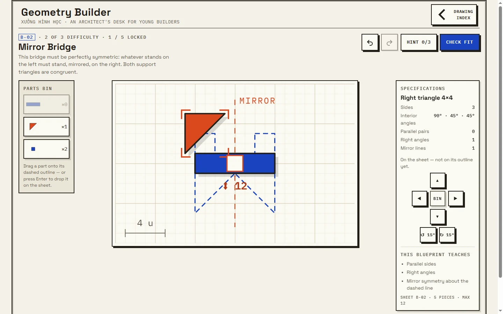
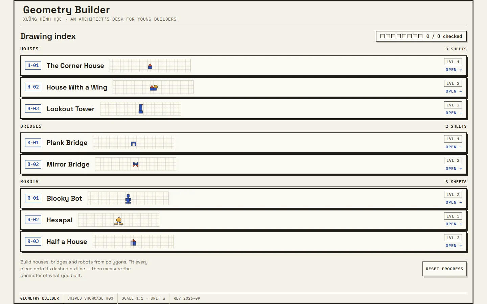
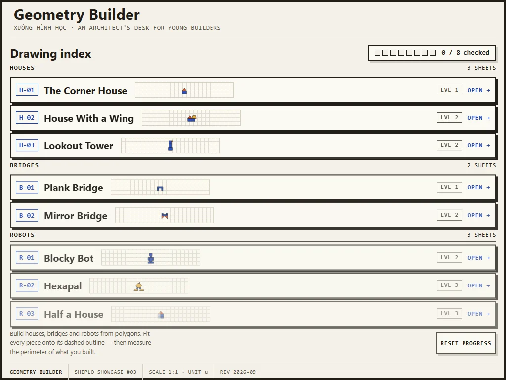
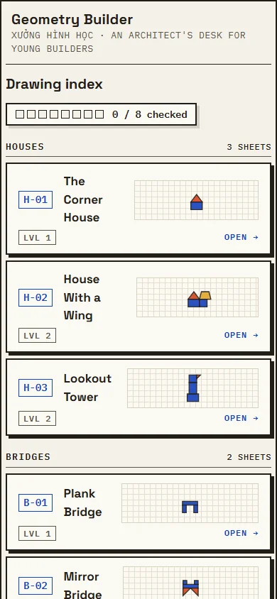

# Geometry Builder

> Shiplo Showcase #03 — a minimal architect's desk where children build
> houses, bridges and robots from polygons by applying shape properties.
> **Xưởng hình học.**

**Live demo:** https://geometry-builder.shiplo.site
**Category:** education-math · **Audience:** 7–11 · **License:** Apache-2.0 (original work)

## The concept

Children learn shape properties — sides, interior angles, parallel pairs,
mirror symmetry, perimeter — not by answering quiz questions, but by
**using** them to finish blueprints on an architect's desk. Each mission is
a drawing sheet: dashed outlines wait to be filled with polygon pieces from
the parts bin, the mirror-line missions only draw half a house, and once a
structure is checked the child *walks its perimeter*, clicking edge after
edge while the measurements accumulate like a tape measure.

Everything on screen is drawn as SVG from coordinates in
`public/data/shapes.json` — the Bauhaus palette (off-white drafting paper,
cobalt / vermilion / mustard, graphite ink, hard offset shadows, radius 0),
graph-paper canvas, dashed dimension lines, the CHECKED stamp, and the
title block along the bottom of the sheet.

### The missions

Eight blueprints in three tracks, all defined in
`public/data/challenges.json`:

- **Houses** — The Corner House (2 pieces), House With a Wing (4, trapezoid
  eaves), Lookout Tower (4, the flag that breaks symmetry).
- **Bridges** — Plank Bridge (3, piers must stand plumb), Mirror Bridge
  (5, congruent mirrored supports — the spec's `bridge-02` example).
- **Robots** — Blocky Bot (7, every piece respects the mirror line),
  Hexapal (6, three parallel pairs in the hexagon body), Half a House
  (mirror challenge: the left half is printed, build the right half).

A new mission is added by adding JSON — never by touching components.
The shape catalog (`public/data/shapes.json`) defines 13 polygons; 12 are
used by the shipped missions (the parallelogram sits in the kit for future
sheets).

## Screenshots

All captures are from the live deployment — [geometry-builder.shiplo.site](https://geometry-builder.shiplo.site).

| | |
|---|---|
|  | **Cover** — Mirror Bridge mid-build: deck and one mirrored support placed, triangle selected with its spec sheet, the draggable mirror line down the middle. |
|  | **Desktop 1440×900** — the drawing index with all eight blueprint tabs. |
|  | **Tablet 1024×768** — the hero viewport for classroom use. |
|  | **Mobile 390×844** — limited support: cards stack, tablet is the intended viewport. |

## Interactions

- **Drag** pieces from the parts bin onto the dashed outlines (pointer
  events, mouse and touch). Pieces snap to the unit grid; rotation snaps
  to 15° steps. On mirror missions the **mirror line itself is draggable**
  — grab its grip and slide it; symmetry is checked about wherever the
  child leaves it, so a mis-placed line is a discoverable mistake, not a
  hidden one (arrow keys move it in steps, Home or the inspector's
  *Reset mirror line* button restore the blueprint's own line).
- **Full keyboard path** (definition of done): Tab to a bin piece, Enter
  drops it on the sheet; arrow keys move 1 unit (Shift = 4), `R`/`E` rotate
  ±15°, Delete returns the piece to the bin. The inspector also exposes
  real move / rotate / bin buttons — dragging is never the only way.
- **Undo / redo** of every action, in memory, up to 50 steps back.
- **3-level hint ladder**: pulse the next slot → reveal the ghost shape →
  show the rotation it needs.
- **Check fit** validates coverage, piece budget and true mirror symmetry
  (the engine reflects every piece across the line and compares vertex
  sets). Gentle nudges only — nothing red, nothing punitive.
- **Measurement review**: after CHECKED, walk the outer boundary of the
  build — computed by cancelling shared oriented edges — with dimension
  labels, right-angle marks and parallel-pair tick marks appearing as the
  perimeter totals up.
- Anonymous `localStorage` progress (which sheets are checked / measured)
  with a reset in the lobby. Nothing personal is stored.

## Stack — Angular, proven static

This is the first **Angular** showcase in the collection: a standalone
-components app (no Angular Material, no router — navigation is pure
state) built by `@angular/build:application` into a fully static artifact:

- All geometry and rules live in a **pure engine**
  (`src/app/features/workbench/engine.ts`, zero Angular imports) that is
  also exercised headless by `npm run test:engine` — 300+ checks over every
  mission: data validation, solve/nudge/undo paths, outline computation,
  perimeter walks, mirror twin verification (including the moved mirror
  line).
- Content is fetched from local JSON at runtime — no API, no database, no
  server runtime, document-relative URLs so the artifact works from any
  base path.
- Fonts are bundled via `@fontsource` (Space Grotesk + IBM Plex Mono, latin
  and latin-ext subsets) — no runtime CDN.
- GSAP 3.15 is bundled for purposeful motion only (snap settle, blueprint
  reveal, the CHECKED stamp, the perimeter tracer), all routed through a
  wrapper that honours `prefers-reduced-motion` by applying final states
  immediately.

## Development

```bash
npm install
npm start          # dev server
npm run build      # production build → dist/ (flattened to its root)
npm run test:engine  # headless engine simulation (no browser needed)
```

Serve `dist/` with any static host — that is exactly what
https://geometry-builder.shiplo.site runs.

## Project structure

```text
geometry-builder/
├── angular.json / package.json + lockfile
├── src/
│   ├── app/
│   │   ├── features/
│   │   │   ├── lobby/          # drawing index (mission select)
│   │   │   ├── workbench/      # canvas + parts bin + inspector
│   │   │   │   └── engine.ts   # pure geometry/rules engine (no Angular)
│   │   │   └── review/         # perimeter walk + annotations
│   │   ├── lib/                # gsap wrapper, data loader, storage
│   │   └── shared/             # shape-view (SVG polygon primitive)
│   └── styles/                 # tokens / base / motion layers
├── public/
│   └── data/                   # shapes.json + challenges.json (the content)
├── scripts/                    # engine-sim, CDP driver, cover capture
├── design/DESIGN_DECISIONS.md  # locked design system
└── showcase/                   # screenshots, metadata, deployment manifest
```

## Open source

This project is part of the Shiplo Showcase and is distributed under the
Apache License 2.0. See `LICENSE` and `NOTICE`. It is art-directed and
maintained by Shiplo HQ with AI-assisted implementation.

Shiplo names, logos and brand assets are handled separately from the
source-code license. See the repository `TRADEMARKS.md`.

Third-party material redistributed with this project — Angular (MIT),
RxJS (Apache-2.0), tslib (0BSD), GSAP (GreenSock Standard No-Charge
license, not MIT), Space Grotesk and IBM Plex Mono (SIL OFL 1.1 via
@fontsource) — is documented in `THIRD_PARTY_NOTICES.md`.

## Security and production use

This project is a demonstration/reference implementation, not a security
audit or a production-readiness guarantee. If you adapt it for production
use, you are responsible for reviewing and hardening the code for your own
threat model, dependencies, privacy requirements, compliance obligations,
hosting configuration and user data. See `SECURITY.md` in the repository
root for the reporting policy.
