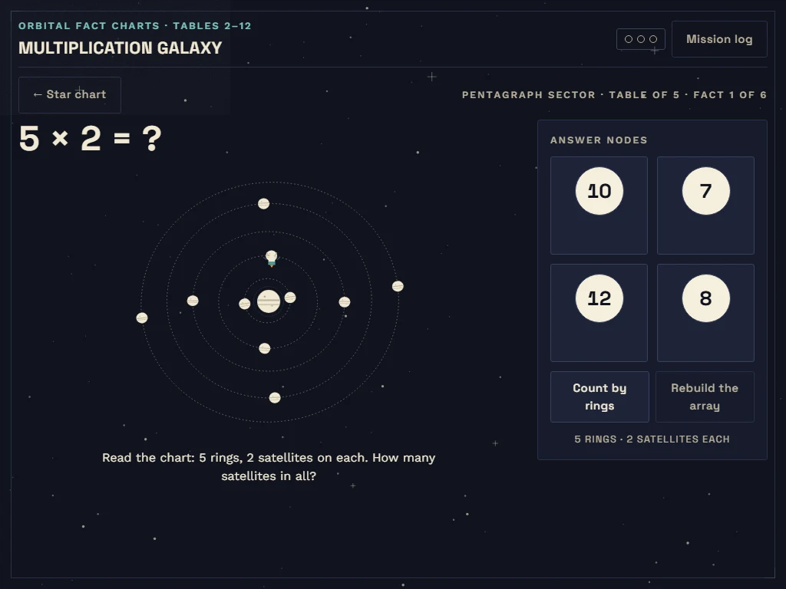

# Multiplication Galaxy

> Shiplo Showcase #04 — a silk-print star chart where children 7–10 read planet
> orbit arrays as multiplication facts and lock stable orbits by answering them.

**Live demo:** <https://multiplication-galaxy.shiplo.site>
**Category:** education-math · **Audience:** 7–10 · **License:** Apache-2.0 (original work)

A retro-future astronomy atlas, silk-printed. Every multiplication fact is
drawn the way an atlas would draw it: **4 × 6 is four orbit rings, each
carrying six satellites** around a central planet. The child reads the array,
answers via four "orbital nodes", and a correct answer morphs the drifting,
messy ellipses into locked circular orbits with registration ticks — the fact
becomes stable knowledge, shown as a stable chart. Eleven constellations (one
per table, 2–12) chart an expedition across the galaxy map; the Mission Log
records mastery as a local-only matrix.

## Highlights

- **Arrays as orbit systems** — groups (rings) × items (satellites) drawn as
  one structure; missing-factor missions mask a factor in the same picture, so
  division stays connected to multiplication.
- **Repeated addition on demand** — "Count by rings" lights rings one at a
  time with a running skip-count (6 · 12 · 18 · 24), before and after locking.
- **Lock-as-feedback** — correct answers stabilize the chart (GSAP ellipse→
  circle morph + tick draw); wrong answers "drift" with course hints, never
  red alarms, never lost progress, no timers anywhere.
- **Art direction from print, not from neon** — ink-navy silk ground, hairline
  cream chart rules, flat two-tone halftone planets, procedural starfield and
  `feTurbulence` grain; Space Grotesk numerals set like poster astronomy.
- **Fully static, fully local** — all content (11 galaxies, 66 facts) is JSON
  under `public/data/`; progress is anonymous `localStorage` with an explicit
  reset; no API, no database, no runtime CDN.

## Screens

| Screen | What happens |
|---|---|
| **Star chart (map)** | 11 constellation groups along a chart path; each shows live mastery (n/6 orbits) and its miniature orbit system |
| **Mission (array)** | The a×b orbit system with fact readout, four orbital answer nodes, count-by-rings and array replay |
| **Mission (missing factor)** | The full array with one factor masked (`6 × ? = 42`) — count rings or satellites to infer it |
| **Mission log** | 11×6 mastery matrix of orbit glyphs with text equivalents; two-step anonymous-progress reset |

## Interactions

- **Answer**: click/tap an orbital node, or Tab to the group and use arrow
  keys + Enter/Space (roving radiogroup).
- **Count by rings**: sequential ring highlight with running total, announced
  to screen readers; `+1 ring` / `Reset count` while active.
- **Show the array**: replays the ring-by-ring build-up (spatial comprehension).
- **Ring hover/tap** (pointer enhancement): lights a ring and shows its
  cumulative group.
- **Pacing**: "Next fact" appears only after a lock — the child owns the pace.
  Streak pips ("signal strength") are cosmetic, capped at 3, and never gate
  anything.

## Screenshots

All captures are from the live deployment (<https://multiplication-galaxy.shiplo.site>).

| Shot | Viewport | Shows |
|---|---|---|
| `showcase/tablet.webp` | 1024×768 | **Hero** — mission stage: `2 × 6 = ?` over the drifting orbit array, answer-node dials, count-by-rings instruments |
| `showcase/cover.webp` | 1440×900 | Art-directed staged moment — the `4 × 6` orbit just locked, skip-count total 24 showing |
| `showcase/desktop.webp` | 1440×900 | Honest landing — the star chart with all eleven constellations and their progress |
| `showcase/mobile.webp` | 390×844 | Honest mobile landing — the expedition grid |



## Stack & architecture

React 18 + Vite 7 + TypeScript; GSAP 3.15 (MotionPath) for the lock morph,
probe transfer and array build-up, always through `src/lib/gsap.ts` so
`prefers-reduced-motion` collapses every tween to its final state. Fonts are
self-hosted via `@fontsource` (Space Grotesk + Work Sans, latin + latin-ext +
vietnamese subsets). State is three-layer per the spec:

- **Content** — `public/data/galaxies.json` + `missions.json`, validated at
  load time (bad data degrades to a clear message, never a white screen).
- **Interaction** — a pure, React-free engine (`src/features/mission/engine.ts`)
  runs the fact loop; `scripts/engine-sim.mjs` simulates all 66 missions
  headless (`npm run test:engine`).
- **Personal** — anonymous `localStorage` (`locked` facts + streak) with a
  reset in the Mission Log.

Single-page state, hash-free; every asset is bundled — the artifact runs from
any static subpath (`base: './'`).

## Development

```bash
npm install
npm run dev        # local dev server
npm run test:engine  # headless simulation of every mission
npm run build      # type-check + production build → dist/
npm run preview    # serve dist/ locally
```

## Deploy to Shiplo

`dist/` is a complete static artifact. Deploy via the Shiplo platform
(`routing_mode: "static"`, build command `npm run build`, output `dist/`) —
see the repository `docs/DEPLOYMENT.md`; provenance is recorded in
`showcase/deployment.json` (URL, source commit, artifact SHA-256).

## Project structure

```text
multiplication-galaxy/
├── README.md · LICENSE · NOTICE · THIRD_PARTY_NOTICES.md
├── package.json + package-lock.json   # committed
├── index.html · vite.config.ts · tsconfig*.json
├── design/DESIGN_DECISIONS.md         # locked design system (internal)
├── public/data/                       # galaxies.json · missions.json (content)
├── scripts/                           # gen-content · engine-sim · cdp-driver · capture-cover
├── src/
│   ├── components/                    # Starfield · Planet · Icons
│   ├── features/map|mission|log|shared/
│   ├── lib/                           # data · storage · gsap · types
│   └── styles/                        # tokens · base · motion
├── showcase/                          # deployment.json · metadata.json · *.webp
└── dist/                              # generated, gitignored — the deploy artifact
```

## Open source

This project is part of the Shiplo Showcase and is distributed under the
Apache License 2.0. See `LICENSE` and `NOTICE`.

Shiplo names, logos and brand assets are handled separately from the
source-code license. See the repository `TRADEMARKS.md`.

Third-party material redistributed with this project is documented in
`THIRD_PARTY_NOTICES.md` (policy: repository `THIRD_PARTY_POLICY.md`).
Provenance: art-directed and maintained by Shiplo HQ with AI-assisted
implementation.

## Security and production use

This project is a demonstration/reference implementation, not a security
audit or a production-readiness guarantee.

If you adapt it for production use, you are responsible for reviewing and
hardening the code for your own threat model, dependencies, privacy
requirements, compliance obligations, hosting configuration and user data.

See `SECURITY.md` in the repository for the reporting policy and the
production-use checklist.
