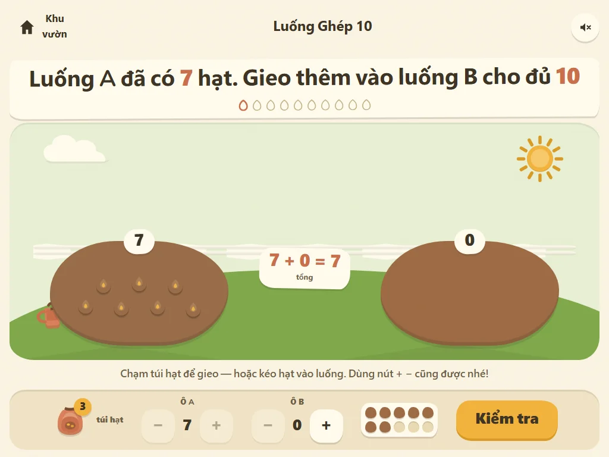

# Number Garden · Khu vườn số học

> Shiplo Showcase #01 — A paper-cut garden where children grow plants by building and splitting numbers within 20.

**Live demo:** <https://number-garden.shiplo.site>
**Category:** education-math · **Audience:** 5–7 tuổi · **License:** Apache-2.0 (original work)



A hand-cut paper garden for children building number sense: đếm 1–1, part–whole
within 10, cộng/trừ within 20. Trẻ không "làm đề" — trẻ gieo hạt, bốc hạt vào
giỏ và nhìn thấy số lượng đổi qua numeral + ten-frame + chính nhóm hạt.
Bốn luống cây: **Đếm Hạt · Ghép 10 · Cộng · Bốc Hạt** (mỗi luống 10 câu).

## Highlights

- **Ba đường vào ngang hàng:** kéo-thả (pointer: mouse/touch/pen), chạm túi hạt,
  và stepper `+ −` 56px cho bàn phím — không ai phải mô phỏng kéo pixel.
- **Part–whole hiện vật lý:** phép trừ tách thành *luống còn lại + giỏ bốc ra*;
  sau mỗi 3 câu đúng, number bond hiện thành cành cây tách nhánh.
- **Lỗi không bị phạt:** trả lời sai = gợi ý + ten-frame highlight ô thiếu,
  hạt không bị reset, không đỏ, không rung, không âm báo lỗi.
- **Paper-cut botanical thật:** SVG gốc cho mọi minh hoạ (hạt, mầm 3 giai đoạn,
  hoa, hàng rào, bình tưới), bóng giấy đặc lệch 3px không blur, nền kem có vân
  giấy (asset raster duy nhất, sinh qua Codex imagegen).
- **GSAP có mục đích:** Flip tái bố trí hạt, seed→sprout→flower ~700ms khi đúng;
  `prefers-reduced-motion` tắt sạch motion nhưng giữ 100% playable.

## Development

```bash
npm install
npm run dev        # local dev server
npm run build      # type-check + production build → dist/
npm run preview    # serve dist/ locally
npm run test:engine  # headless simulation of all 40 questions
```

Demo path (2 phút): mở link live → chọn **Luống Ghép 10** → chạm túi hạt 3 lần
→ **Kiểm tra** → nhìn bond sau 3 câu → để ý nút loa (mặc định tắt) và nút
`Xoá tiến độ` ở màn chính.

## Project structure

```text
number-garden/
├── README.md
├── LICENSE / NOTICE / THIRD_PARTY_NOTICES.md
├── package.json + package-lock.json
├── index.html · vite.config.ts · tsconfig.json
├── src/
│  ├── features/          # home / play (engine.ts = pure logic) / why / end
│  ├── components/art.tsx # code-native paper-cut SVG library
│  ├── lib/               # gsap wrapper (reduced-motion), data, audio, storage
│  └── styles/            # tokens / base / motion
├── public/
│  ├── data/              # lessons.json · rewards.json — toàn bộ nội dung bài học
│  └── assets/generated/  # paper-texture.png (Codex, provenance trong design/)
├── design/               # internal: DESIGN_DECISIONS, IMAGE_BRIEF, manifest
├── showcase/             # metadata.json · deployment.json · 4 screenshots webp
└── dist/                 # generated, gitignored — deploy artifact
```

**Kiến trúc tĩnh thuần:** không backend, không API, không DB, không auth.
Nội dung chạy từ JSON local; progress ẩn danh (số sao theo luống, tuỳ chọn âm
thanh) nằm trong `localStorage` và xoá được bằng một nút.

## Verification (pilot)

- `npm run test:engine` — mô phỏng đủ 40 câu (plant/remove/nudge/undo/bond cadence).
- CDP headless flow (mouse + touch + keyboard) chống URL live ở 1440×900,
  1024×768, 390×844 — zero console errors, mọi nút ≥ 44px, reduced-motion OK.
- `npm run verify:static` — artifact tự chứa, không CDN runtime.
  Kết quả deploy: `showcase/deployment.json` (URL, commit SHA, artifact SHA-256).

## Open source

This project is part of the Shiplo Showcase and is distributed under the
Apache License 2.0. See `LICENSE` and `NOTICE`.

Shiplo names, logos and brand assets are handled separately from the
source-code license. See the repository `TRADEMARKS.md`.

Third-party material redistributed with this project (React, GSAP, Baloo 2 /
Nunito fonts, generated texture) is documented in `THIRD_PARTY_NOTICES.md`
(policy: repository `THIRD_PARTY_POLICY.md`).

## Provenance

Art-directed and maintained by Shiplo HQ with AI-assisted implementation
(Claude Code — code & SVG art; OpenAI Codex imagegen — paper-grain texture per
`design/IMAGE_BRIEF.md`, provenance in `design/generated-manifest.json`).

## Security and production use

This project is a demonstration/reference implementation, not a security
audit or a production-readiness guarantee.

If you adapt it for production use, you are responsible for reviewing and
hardening the code for your own threat model, dependencies, privacy
requirements, compliance obligations, hosting configuration and user data.

See `SECURITY.md` in the repository for the reporting policy and the
production-use checklist.
