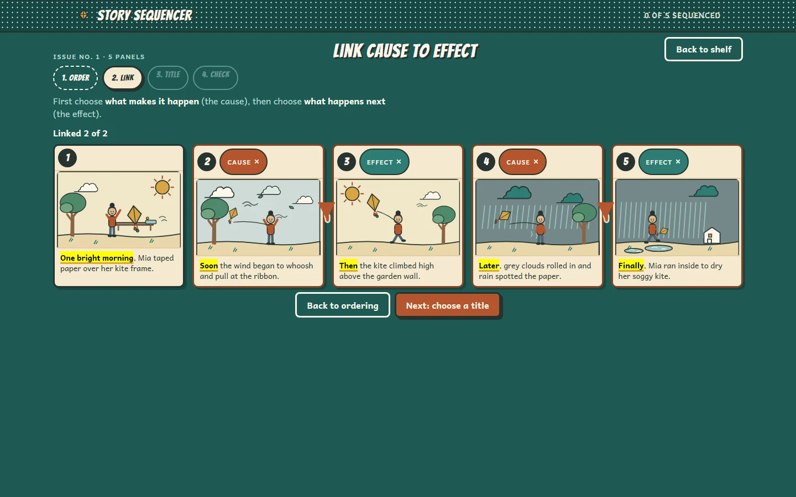

# Story Sequencer · Xưởng kể chuyện

**Shiplo Showcase #10** — a graphic-novel storyboard desk where children aged
7–11 put shuffled story panels back in order, connect each cause to its
effect, and write the title the story deserves.

Live demo: **https://story-sequencer.shiplo.site**



## The idea

A comic workshop, not a quiz app. Five original stories ship as pure JSON;
every story frame is an original SVG illustration drawn from a shared visual
vocabulary (sky states, seasons, props) so the *sequencing* task can be solved
by reading the pictures, not just the words. A child:

1. **Orders** — drags shuffled panels (or moves them with arrow keys / move
   buttons) until the story reads right. A hint mode underlines only the
   temporal clues — *first, soon, then, later, finally*.
2. **Links** — taps a cause, then taps what it makes happen; a hand-drawn
   rust pencil line connects them. Wrong pairs wobble away gently — no red,
   no buzzers, no scores.
3. **Titles** — picks the title that tells the *whole* story from four comic
   options. The shelf shows the issue as "Title to be written" until then.
4. **Checks** — a timeline runs through the panels to explain the chosen
   order, Order / Connections / Title each get a verdict, and finishing stamps
   the issue **SEQUENCED!** before a reflection question ("What clue helped
   you?") closes the loop.

Progress is anonymous and local (which issues are sequenced), always resettable
from the shelf. Mobile support is limited: the shelf and board reflow to a
single column with move buttons as the primary reorder path — the experience
is designed for tablet and desktop.

## Screenshots

| Image | Viewport | What you see |
|---|---|---|
| `showcase/cover.webp` | 1440×900 | Art-directed staged state: issue 1 mid-story on the storyboard desk — five panels in solved order, time clues underlined, both cause-effect pencil connectors drawn (step 2 · LINK active) |
| `showcase/desktop.webp` | 1440×900 | Honest default landing state: the story shelf with five comic issue cards, each titled "Title to be written" |
| `showcase/tablet.webp` | 1024×768 | Honest tablet view of the shelf — four issues fill the first row, the fifth wraps to a second row; no scrollbar (hero viewport) |
| `showcase/mobile.webp` | 390×844 | Limited mobile support: the shelf reflows to a two-column grid |

## Highlights

- **5 stories / 26 original SVG frames** — a shared illustration vocabulary
  keeps every frame distinct (sky, season and prop changes are the visual
  narrative cues the sequencing task depends on).
- **Three ways to reorder** — pointer drag from the handle, ▲/▼ buttons, and
  Arrow/Home/End keys; dragging is never the only path (WCAG 2.2).
- **Pure sequencing engine** — order validation (incl. alternate valid
  orders), causal-link rules, title/reflection rules live in
  `src/app/features/board/engine.ts` with no Angular imports;
  `scripts/engine-sim.mjs` drives all 5 stories + every wrong-order family
  headlessly (358 checks).
- **JSON-driven content** — a new story is added by dropping JSON into
  `public/data/` plus a scene renderer; dev-time validation rejects bad data
  with a friendly error card, never a white screen.
- **Purposeful GSAP motion** — FLIP reorders (280 ms) keep spatial
  continuity, connectors draw in 350 ms, the verdict timeline explains the
  order in 500 ms, celebration ≤ 900 ms — all disabled under
  `prefers-reduced-motion`.
- **Static-first** — hash navigation, no server calls at runtime, fonts
  bundled from `@fontsource` (latin + latin-ext + vietnamese subsets).

## Stack

- [Angular 21.2](https://angular.dev) (standalone components, zoneless
  change detection, no router — hash-based state) + TypeScript
- [GSAP 3.15](https://gsap.com) (bundled; Flip) for reorder/connector motion
- Andika (body) + Bangers (display), both OFL, bundled via `@fontsource`
- No component libraries, no runtime CDN, no backend

## Static-first architecture

```text
public/data/stories.json   → content layer (fetched once, validated in dev)
src/app/features/board/engine.ts   → pure rules (order/links/title/reflection)
src/app/features/board/scenes.ts   → original SVG scene registry (26 frames)
src/app/features/board/            → storyboard UI (order → link → title → check)
src/app/features/shelf/            → the comic shelf
src/app/lib/                       → content loader, gsap wrapper, progress, hash route
```

State is split in three layers: **content** (JSON), **session** (signals:
step, order, links, title) and **optional personal progress** (anonymous
`localStorage`, resettable). The production build is a flat `dist/` folder
that runs from any static host — no Node, no SSR, no APIs.

## Development

```bash
cd projects/story-sequencer
npm install
npm start          # dev server
npm run test:engine   # headless engine simulation (358 checks)
npm run build      # production build → flat dist/
```

Verify the artifact from the repository root:

```bash
npm run verify:static -- story-sequencer
```

Deploy `dist/` to any static host (the live demo runs on Shiplo).

## License

Apache License 2.0 — see [LICENSE](LICENSE). Third-party material and its
licenses are listed in [THIRD_PARTY_NOTICES.md](THIRD_PARTY_NOTICES.md).

## Security and production use

This project is a demo/reference implementation. It is not a security audit
or a production-readiness guarantee. Anyone adapting it is responsible for
their own security hardening, dependency updates, privacy, compliance,
deployment configuration, testing and threat model.

## Provenance

Part of the [Shiplo Showcase](https://github.com/shiplohq/showcase).
Art-directed and maintained by Shiplo HQ with AI-assisted implementation.
Deployment provenance (URL, source commit, artifact hash) is recorded in
[showcase/deployment.json](showcase/deployment.json).
